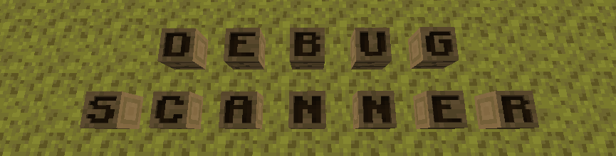

DebugScanner is really only of use to those involved with the GeyserMC project.  It is to be used with a Debug world and
provides tools to allow testing block states between various editions of Minecraft.

Auto scan will will put the player into creative mode and teleport them at a configured interface to each block in succession with the
block number shown in the action bar. 

It will start with the block at (1 70 1) and will continue till it cannot find any more blocks. The first block is
always assumed to be air.

[Video](https://www.youtube.com/watch?v=-p5zkeR5nZA)

## How to Use

1. Generate a Debug world by creating a single player world and holding shift when selecting type. One of the options will
be Debug.

2. Issue the following command:

    !!! example
        /gamerule randomTickSpeed 0
   
2. Import the world into spigot by copying the save file and renaming to world. You will also need to rename level_old.dat to level.dat
or copy a level.dat from a non debug world (note if you do this you'll need to set the gamerule again on first load).

3. Start up the server and join the world

4. Use for the Auto Scannner the following command to start:

    !!! example
        /debugscanner auto start [-start {block number}] [-interval {ticks}] [-pitch {pitch}] [-yaw {yaw}] [player]

5. To stop early use the following command:

    !!! example
        /debugscanner auto stop [player]

